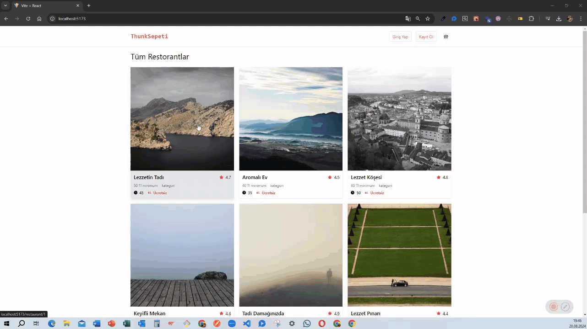

<h1> Sepet Uygulaması (Thunk ile) </h1>

Bu proje, React, Redux, Redux Thunk ve React Router DOM kullanarak geliştirilmiş bir e-ticaret sepet uygulamasıdır. Uygulamada Tailwind CSS kullanılarak şık ve modern bir kullanıcı arayüzü oluşturulmuştur. Ayrıca, json-server kullanılarak basit bir API üzerinden veri çekilmekte ve sepet işlemleri yapılmaktadır.  

<h1> Özellikleri </h1>

- Ürün Listesi Görüntüleme: API'den gelen ürünler liste halinde görüntülenir.  
- Sepete Ekleme/Çıkarma: Kullanıcılar istedikleri ürünleri sepete ekleyebilir veya çıkarabilir.  
- Toplam Fiyat Hesaplama: Sepetteki ürünlerin toplam fiyatı otomatik olarak hesaplanır.  
- Sayfa Geçişleri: React Router DOM ile sayfalar arasında kolayca geçiş yapılabilir.  
- Durum Yönetimi: Redux ile uygulamanın durumu yönetilir, Thunk ile asenkron işlemler gerçekleştirilir.  

<h1> Kütüphaneler </h1>

- Tailwind CSS: Hızlı ve kullanışlı stil oluşturmak için kullanıldı.  
- JSON Server: Sahte bir REST API oluşturmak için kullanıldı.  
- React Redux: Redux ile React bileşenlerini bağlamak için kullanıldı.  
- Redux Thunk: Asenkron işlemler (API çağrıları) için Redux Thunk middleware kullanıldı.  
- React Router DOM: Sayfa yönlendirme işlemleri için kullanıldı.  

<h1> Redux Yapısı </h1>

- Actions: Ürün ekleme, çıkarma gibi işlemleri tanımlar.  
- Reducers: Uygulamanın mevcut durumunu günceller.  
- Thunk: Asenkron işlemleri yönetir (örneğin, API'den ürün verilerini çeker).  

<h1> Uygulama Akışı </h1>

- Ana Sayfa: Ürünlerin listelendiği sayfa.  
- Ürün Detay Sayfası: Bir ürün hakkında daha fazla bilgi görüntüleyebilirsiniz.  
- Sepet: Sepete eklenmiş ürünlerin listelendiği sayfa. Burada ürünleri çıkarabilir veya adedini değiştirebilirsiniz.  

<h1> Ekran Görüntüsü </h1>

